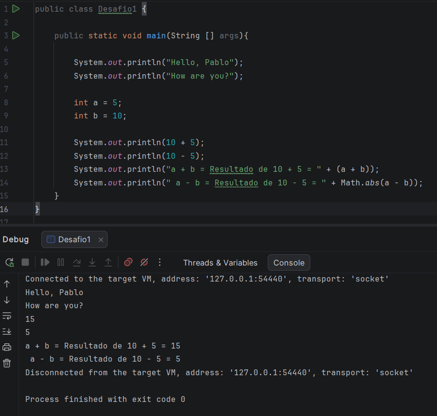

public class Desafio1 {

    public static void main(String [] args){

        System.out.println("Hello, Pablo");
        System.out.println("How are you?");

        int a = 5;
        int b = 10;

        System.out.println(10 + 5);
        System.out.println(10 - 5);
        System.out.println("a + b = Resultado de 10 + 5 = " + (a + b));
        System.out.println(" a - b = Resultado de 10 - 5 = " + Math.abs(a - b));
    }
}

//bint a = 10 + 5; // Atribui o valor 15 à variável a
//int b = 10 - 5; // Atribui o valor 5 à variável b
//int c = 10 * 5; // Atribui o valor 50 à variável c
//int d = 10 / 5; // Atribui o valor 2 à variável d
//int e = 10 % 3; // Atribui o valor 1 à variável e (o resto da divisão de 10 por 3 é 1)

//int a = 10; // Atribui o valor 10 à variável a
//int b = 5; // Atribui o valor 5 à variável b
//int c = 30; // Atribui o valor 30 à variável c
//
//boolean igual = (b == a); //Nesse caso a variável igual ficará com o valor *false*, pois o valor de b não é igual o valor de a.
//boolean diferente = (b != c); //A variável diferente ficará com o valor *true*, pois o valor de b é diferente do valor de c.
//boolean maior = (b > a); //A variável maior ficará com o valor *false*, pois o valor de b é menor que o valor de a.
//boolean menorIgual = (b <= c); //A variável menorIgual ficará com o valor *true*, pois o valor de b é menor que o valor de c.

//String saudacao = "Olá, ";
//String nome = "Alura";
//String mensagem = saudacao + nome + "!";
//
//
//String senha = "12345";
//if (senha.equals("12345")) {
//        System.out.println("Acesso autorizado!");
//} else {
//        System.out.println("Senha incorreta.");
//}
## Resultado

